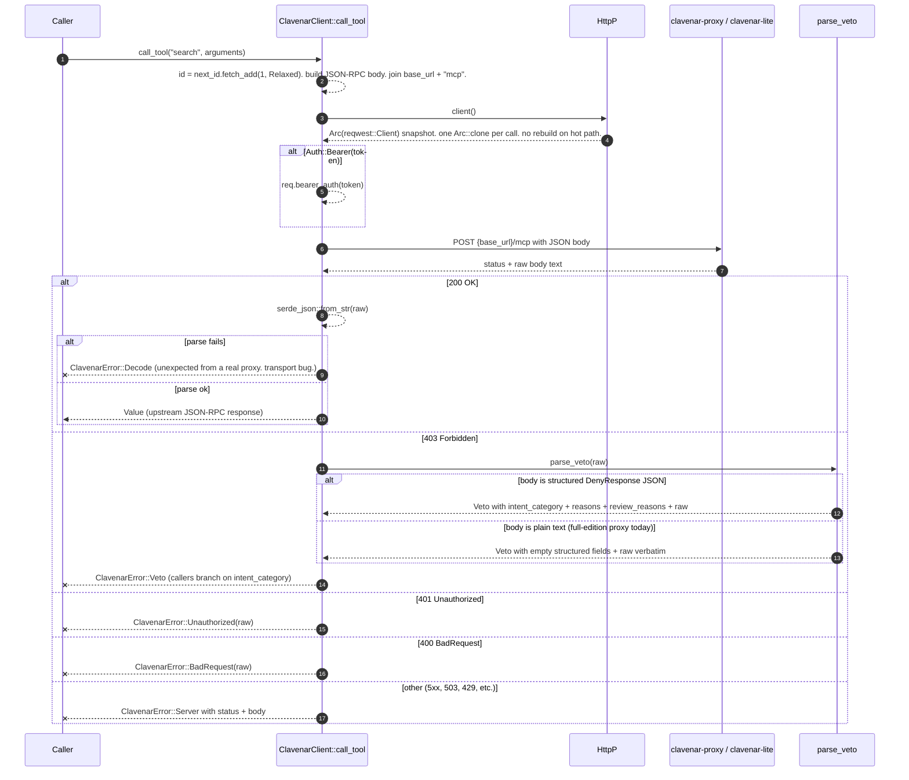
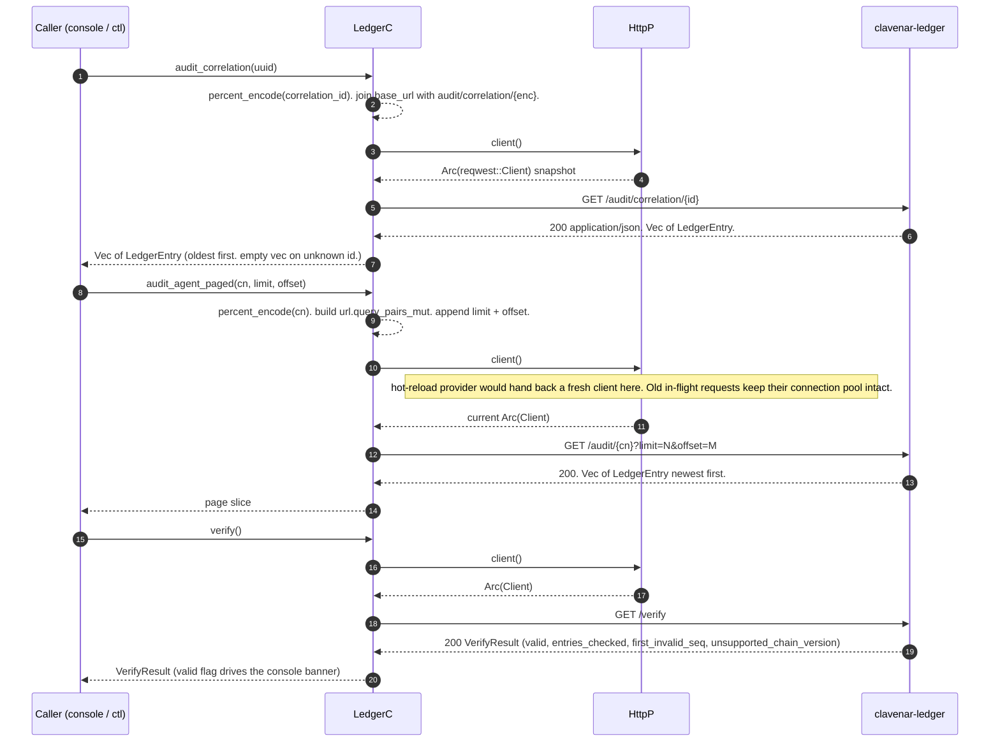
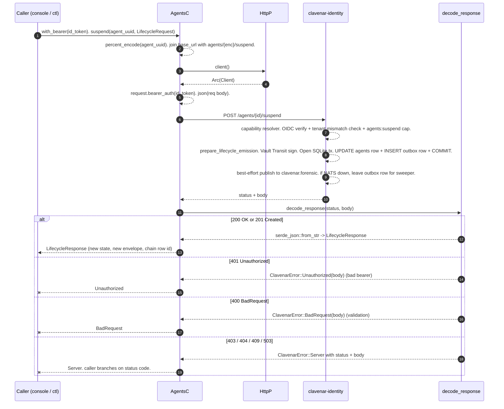
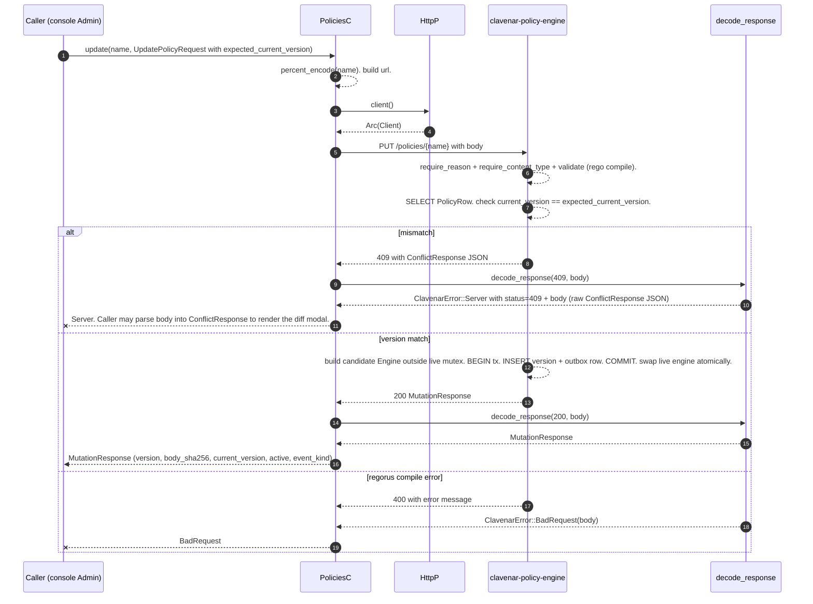
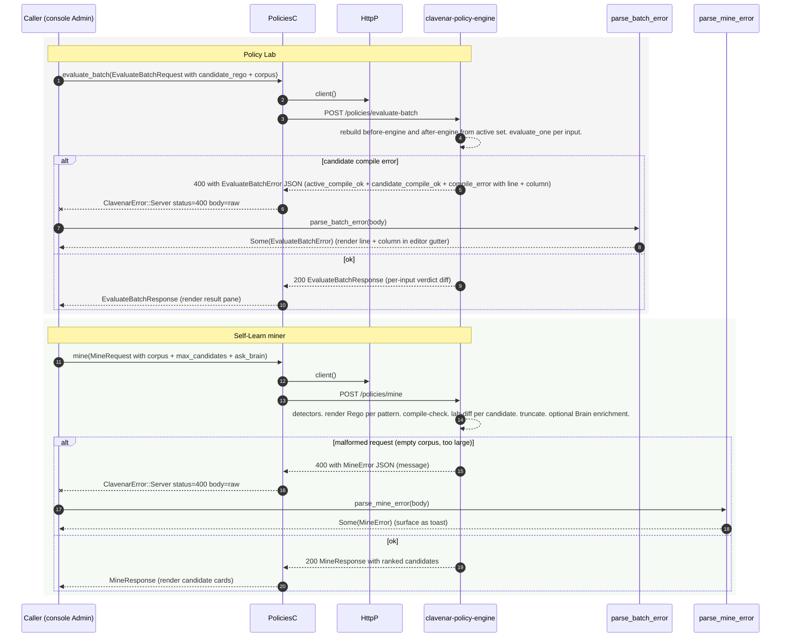
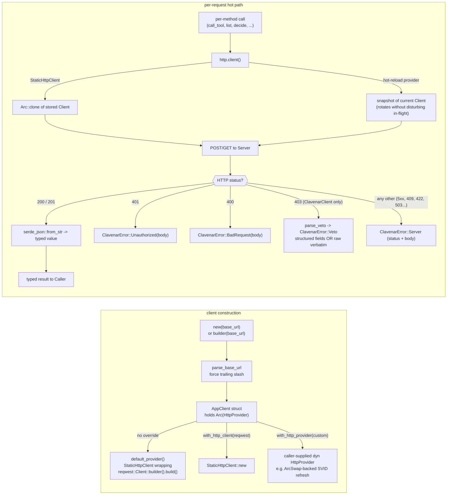

# clavenar-sdk sequence diagrams

Typed async client for Clavenar's HTTP surfaces. Every diagram
below traces one call through the SDK's status-dispatch + error
projection layer, ordered against the actual source: `src/client.rs`,
`src/ledger.rs`, `src/agents.rs`, `src/policies.rs`, `src/brain.rs`,
`src/http.rs`, `src/error.rs`.

## Lifelines

| Lifeline | Role | Source |
|---|---|---|
| Caller | External application, `clavenar-console`, or `clavenarctl`. | — |
| ClavenarC | `ClavenarClient` — `POST /mcp` wrapper. | `src/client.rs` |
| LedgerC | `LedgerClient` — `/audit/*`, `/verify`, `/exports`, `/audit/replay/corpus`. | `src/ledger.rs` |
| AgentsC | `AgentsClient` — `/agents` + `/agents/{id}/<verb>` lifecycle. | `src/agents.rs` |
| PoliciesC | `PoliciesClient` — `/policies/*`, `/policies/evaluate-batch`, `/policies/mine`, `/policies/templates*`. | `src/policies.rs` |
| BrainC | `BrainClient` — loopback local/test compatibility client for `POST /explain-pattern`; not the production exact-mTLS policy-engine caller. | `src/brain.rs` |
| HttpP | `HttpProvider` — per-request `reqwest::Client` source. `StaticHttpClient` wraps one Client; hot-reload integrators return a fresh one per call. | `src/http.rs::HttpProvider`, `StaticHttpClient` |
| Decoder | `decode_response` + `parse_veto` — status-code dispatch to `ClavenarError` arms. | `src/http.rs`, `src/client.rs` |
| Server | The clavenar service the client targets — proxy / ledger / identity / policy-engine / brain. | external |

Every per-service client follows the same shape — `new(base_url)` →
`with_http_client` / `with_http_provider` → method calls that route
through `HttpProvider::client()` per request. The status dispatch
diagram (the flowchart at the end) captures the common decode
path; the five sequence diagrams below show what's distinct per
surface.

---

## 1. `ClavenarClient::call_tool` — proxy `POST /mcp` with veto parse

The headline use case. Wraps the JSON-RPC `tools/call` shape,
attaches bearer auth, dispatches on HTTP status, projects the
structured 403 into `ClavenarError::Veto` with a verbatim `raw`
fallback so callers do not have to special-case the proxy edition.



**Non-obvious behaviour.**

- The 403 path **never** returns `ClavenarError::Decode`. A
  full-edition proxy that returns plain text falls into the
  `Veto with raw verbatim` branch — callers can match on
  `ClavenarError::Veto { raw, .. }` without knowing which proxy
  edition served them. This is the load-bearing edition-agnostic
  property of the SDK.
- `id` is an atomic monotonic counter. Concurrent `call_tool`
  calls from one client get distinct JSON-RPC ids without a
  mutex. `Ordering::Relaxed` is fine — uniqueness is the only
  invariant, not cross-thread happens-before.
- `Auth::None` is the clavenar-lite "open access" default. The
  builder defaults to it; callers opt into `Auth::Bearer`
  explicitly. mTLS / OIDC / SPIFFE are reserved by
  `#[non_exhaustive]` so adding them later is not a breaking
  change.
- `parse_base_url` forces a trailing slash before
  `Url::join("mcp")`. Without it,
  `http://h/api`.join("mcp") becomes `http://h/mcp` (RFC 3986
  replaces the last segment) and silently drops the prefix.
  Every per-service client routes through `parse_base_url`.

### 1a. `ClavenarClient::execute_tool` — registered SDK authority

The SDK-governed convenience path requires one executor callback and the
workload receipt-signing key at construction. It authorizes without an upstream
effect, invokes the clone-shared callback with the exact signed payload, records
the terminal receipt, and returns the callback's actual result. The executable
authorization is not part of `ExecutionOutcome`.

```mermaid
sequenceDiagram
    autonumber
    participant Caller
    participant SDK as ClavenarClient::execute_tool
    participant Proxy
    participant Store as durable intent/outbox store
    participant Executor as registered tool executor
    participant Ledger

    Caller->>SDK: PreparedToolRequest::new(name, arguments)
    SDK-->>Caller: serializable request + locally allocated UUID
    Caller->>SDK: execute_prepared_tool(&prepared)
    SDK-->>SDK: validate retained identity and payload before HTTP construction
    SDK-->>SDK: require executor + signing key + durable store
    SDK->>Proxy: /mcp + side-effect-free clavenar.decision/v1 selector
    Note over Proxy: decision selector permits 0 upstream effects
    Proxy-->>SDK: Identity-signed exact execution payload
    SDK->>Store: commit signed authorization + tenant/workload + digest + IDs
    Store-->>SDK: durable intent committed
    SDK->>Executor: invoke(exact authorized payload + idempotency ID)
    Executor-->>SDK: actual result + effect ID
    SDK-->>SDK: hash actual result; sign terminal receipt
    SDK->>Store: atomically persist actual result/effect + enqueue receipt
    Store-->>SDK: durable outbox entry
    SDK->>Proxy: POST /execution-receipts from outbox
    Proxy->>Ledger: commit execution.completed
    Ledger-->>Proxy: recorded
    Proxy-->>SDK: non-executable receipt metadata
    SDK->>Store: mark receipt delivered
    SDK-->>Caller: actual result + effect ID + receipt metadata
```

Missing executor, signing-key, or durable-store configuration fails before the
authorization request. Unavailable intent persistence fails before the
executor. A deny or invalid
authorization never invokes the executor. Receipt failure returns an error and
leaves the signed entry pending; bounded outbox redelivery never authorizes or
executes a tool. Governed execution success is not reported until the actual
result/effect and receipt are durably committed and delivery is confirmed. The decision selector is versioned
independently from `clavenar.execution/v1` evidence. An absent selector means
the explicit legacy server-execution `/mcp` contract; the SDK governed path
never retries by falling back to that mode.

Prepared single-tool and batch values own a canonical UUID before this
sequence begins. They can be serialized and restored unchanged after a process
restart. Repeated authorization of the exact prepared value returns Proxy's
retained signed decision with no upstream execution; a changed payload under
the same identity conflicts. Invalid restored values stop before any network
attempt.

`execute_tool_batch` uses the same authority chain with one canonical
`clavenar/tools.batch` envelope. Proxy evaluates and signs the complete ordered
set; no sibling reaches the registered executor until the whole batch is
approved. HIL modification re-gates the complete candidate, while deny,
review, expiry, cancellation, and policy change release zero siblings.

---

## 2. `LedgerClient` — audit fetch and verify

The widest surface in the SDK: ~31 methods against `clavenar-ledger`,
spanning audit/correlation reads, the temporal-intelligence analytics
family, regulatory + compliance exports, and the incident-case write
family (`create_case`, `set_case_status`, `classify_case`, …). Reads
funnel through `get_json` (200-only); writes through `post_json` (any
2xx, empty body → `()`); both snapshot `HttpProvider::client()` per
request. The full per-method route table lives in
[`ENDPOINTS.md`](./ENDPOINTS.md). The diagram shows the common operator
workflow — pull a correlation join, page through an agent's history, run
a chain verify — to surface the per-call hot-reload semantics.



**Non-obvious behaviour.**

- `audit_agent_paged` exists alongside `audit_agent` (full-chain)
  so UI callers can scale memory with `per_page` instead of chain
  depth. `audit_agent_count` pairs with it to drive
  total-pages math without a row read.
- `percent_encode` is the SDK's tiny RFC 3986 encoder.
  `Url::join` does **not** percent-encode path segments — a
  correlation_id with a `/` or `?` in it would reroute the
  request otherwise. UUIDs are hex-only so the encode is a no-op
  in the common case but defensive in general.
- `base_url()` and `http_client()` are exposed for callers that
  need SSE-streaming responses (`clavenar-console`'s live-tail
  proxy is the first such caller). The SDK still owns canonical
  request shaping; a streaming response cannot ride through the
  JSON-decode pipeline.
- `verify()` returns three distinct "valid=false" reasons:
  chain-hash tamper (`first_invalid_seq` set), unknown chain
  version (`unsupported_chain_version` set), and stale JWKS
  (also unsupported_chain_version so a caller that only checks
  `valid` still notices). The mapping is server-side — the SDK
  passes the typed envelope through unchanged.

---

## 3. `AgentsClient` lifecycle — bearer-authenticated CRUD

Mirrors `clavenar-identity`'s nine-endpoint lifecycle surface. Each
call carries `Authorization: Bearer <oidc_id_token>`; the server
validates against the per-tenant JWKS and resolves IdP groups to
capability strings. Diagram shows the suspend path; the other
seven `/agents/{id}/<verb>` endpoints are shape variants.



**Non-obvious behaviour.**

- The SDK does NOT lift a tenant-mismatch 404 into a typed error.
  The server returns 404 (not 403) for cross-tenant reads to
  avoid leaking row existence; the SDK passes that through as
  `ClavenarError::Server` and lets callers branch.
- `create_request_matches` is exposed at the crate root for
  `clavenarctl agents create --if-absent` idempotent IaC patterns.
  Callers compare a `CreateAgentRequest` against an existing
  `AgentRecord` to decide whether to skip the POST.
- The bearer token is per-`AgentsClient`-instance, not per-call.
  Multi-tenant callers build one client per tenant — the SDK does
  not hold a token map.
- `MIGRATION_ACTOR_SUB_PREFIX` is exposed so callers minting their
  own actor_sub for migration tooling do not collide with the
  reserved prefix the server uses to tag system-driven lifecycle
  rows.

---

## 4. `PoliciesClient::update` — optimistic concurrency with conflict

The mutation surface (`create`, `update`, `activate`, `deactivate`,
`delete`, `rollback`, `install_template`) all carry
`expected_current_version` and round-trip 409 with a typed
`ConflictResponse` body. The console renders the conflict as a
"reload the editor?" modal.



**Non-obvious behaviour.**

- The 409 body **is** a `ConflictResponse` (typed). The SDK
  surfaces it as `ClavenarError::Server { status: 409, body }`
  rather than projecting it into a typed variant — callers that
  care parse the body via `serde_json::from_str::<ConflictResponse>(&body)`.
  The asymmetry with `Veto` is deliberate: 403 has one shape
  (security veto) per spec; 409 from the policy surface has
  multiple potential shapes as the surface grows, and the SDK
  does not commit to one.
- `decode_response` routes `409` (and `422`, `5xx`) all into the
  `Server` arm. Only `200`/`201`, `401`, and `400` get typed
  treatment in the shared decode helper. `ClavenarClient` keeps its
  own dispatcher because of the 403 → `Veto` parse step that the
  shared helper does not cover.
- `delete` is **soft** delete. The handler stamps `deleted_at`
  on the row; the policy stays visible at `GET /policies?include_deleted=true`.
  Callers that want hard-delete semantics do not have an SDK
  affordance — they would have to truncate the SQLite store
  directly, which the SDK refuses by surface area.

---

## 5. Lab and Miner — typed-error lift via `parse_batch_error` / `parse_mine_error`

Two adjacent endpoints with different 400 shapes. The SDK ships
free functions to lift the typed envelope out of
`ClavenarError::Server.body` so callers can render a structured
error (compile line/column for Lab; corpus-shape message for
Miner) without re-implementing the parse.



**Non-obvious behaviour.**

- Both `parse_batch_error` and `parse_mine_error` return
  `Option`, not `Result`. A `None` means the 400 body did not
  match the typed envelope shape — most likely a future server
  version emitting a different envelope. Callers fall through to
  rendering `ClavenarError::Server.body` raw, which keeps the SDK
  forward-compatible without breaking call sites.
- `EvaluateBatchError` carries `active_compile_ok` and
  `candidate_compile_ok` as separate flags. The Lab UI uses
  them to disambiguate "your candidate broke" from "the active
  bundle broke" (a genuinely catastrophic state — but possible
  if the operator was mid-edit on a separate session).
- `MineRequest::ask_brain` is opt-in. When `false` (the default),
  the policy-engine skips the Brain enrichment step and returns
  candidates with template one-liners. The SDK does not enforce
  this — `ask_brain=true` against an unconfigured Brain produces
  candidates that silently fall back to the template, which is
  the documented contract. In production, this service-to-service step uses
  policy-engine's current exact workload identity; it does not dispatch
  through the generic SDK `BrainClient`.
- The Miner's accepted candidates are NOT auto-installed. The
  operator clicks Accept in the console; the console POSTs
  `MineCandidate.rego_body` as a normal `CreatePolicyRequest`
  with `active=false`, landing it as a draft. The miner endpoint
  itself is stateless — no DB writes happen there.

---

## HttpProvider dispatch + status code routing



**Invariants.**

- Every per-service client snapshots the `reqwest::Client` via
  `HttpProvider::client()` **per request**. Implementors never
  cache the `Arc<Client>` across requests — the whole point of
  the indirection is to let credential-rotation machinery swap
  TLS identities between calls without disturbing in-flight
  requests. reqwest's connection pool retains the old identity
  for any connection that has not idled out.
- 403 dispatch is **ClavenarClient-only**. `parse_veto` lives in
  `client.rs` because only `POST /mcp` produces a security veto.
  Other surfaces' 403s (e.g. capability denied on
  `/agents/{id}/suspend`) fall through to `ClavenarError::Server`
  with status 403 — no false projection into `Veto`.
- The status dispatch table is the SDK's stability contract. New
  status codes the SDK does not understand land in `Server` so
  callers can branch on the raw status — the alternative would
  be silent breakage when a server adds a new error shape.

---

## Source pointers

The exhaustive per-method route → return-type table lives in
[`ENDPOINTS.md`](./ENDPOINTS.md), kept in sync with source. The
pointers below name the owning modules plus the non-route symbols the
diagrams above lean on.

- Proxy hot path: `src/client.rs::ClavenarClient` (`builder`,
  `call_tool`, `send_jsonrpc`, `send_raw`, `parse_veto`)
- Auth + non-exhaustive enum: `src/client.rs::Auth`
- Ledger client: `src/ledger.rs::LedgerClient` (audit/correlation
  reads, the analytics family, regulatory/compliance exports, and the
  incident-case writes — full list in `ENDPOINTS.md`)
- Agent lifecycle: `src/agents.rs::AgentsClient`; idempotency helper
  `create_request_matches`; migration constant
  `MIGRATION_ACTOR_SUB_PREFIX`
- Policy management: `src/policies.rs::PoliciesClient`
- Typed error lifters: `src/policies.rs::parse_batch_error`,
  `parse_mine_error`, and `PoliciesClient::parse_conflict`
- Brain explain-pattern compatibility client:
  `src/brain.rs::BrainClient::explain_pattern` (loopback local/test only;
  production uses policy-engine's exact workload identity)
- Simulator control: `src/sim.rs::SimClient`
- HTTP plumbing: `src/http.rs` (`HttpProvider`,
  `StaticHttpClient`, `default_provider`, `parse_base_url`,
  `decode_response`, `percent_encode`)
- Error envelope: `src/error.rs::ClavenarError`
